# Production Maintenance and Incident Response Runbook

## Overview
This repository documents a comprehensive Site Reliability Engineering (SRE) and Operations drill. The project focuses on maintaining, monitoring, and recovering a production-ready React application served via Nginx on an Ubuntu Linux environment.

## Technology Stack
* Operating System: Ubuntu Linux
* Web Server: Nginx
* Application: React (Single Page Application)
* Networking: IPv4, UFW (Uncomplicated Firewall)
* Process Management: systemd

## Operations Performed

### 1. Network Validation
Verified external and internal network connectivity to ensure the web application is safely exposed.
* Confirmed Nginx is actively listening on port 80 (HTTP) and SSH is secured on port 22.
* Verified UFW status to ensure strict access control.

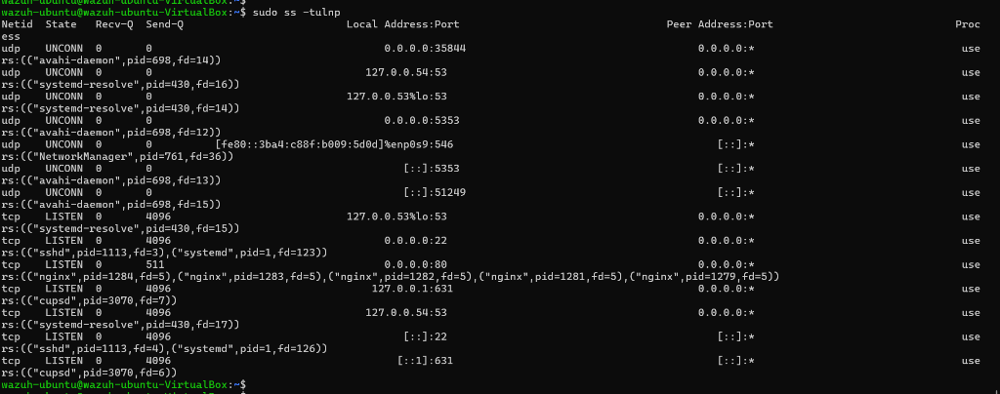
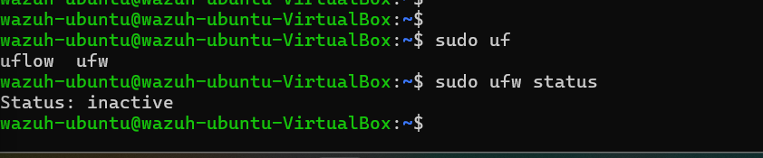

### 2. Service Health and Systemd Validation
Executed rigorous health checks on the Nginx web server.
* Validated configuration syntax prior to live reloads.
* Inspected background master and worker processes.

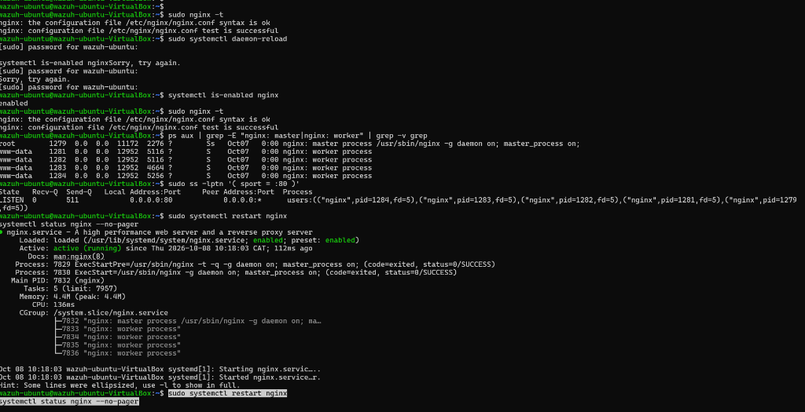

### 3. Traffic and Error Log Analysis
Simulated live traffic and analyzed server logs to confirm request handling.
* Audited Nginx access logs to trace digital footprints and user agents.
* Audited Nginx error logs and systemd journalctl to ensure zero unhandled exceptions.

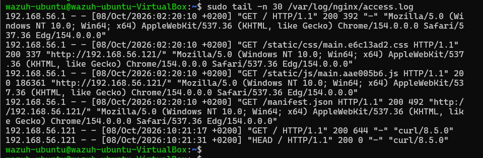
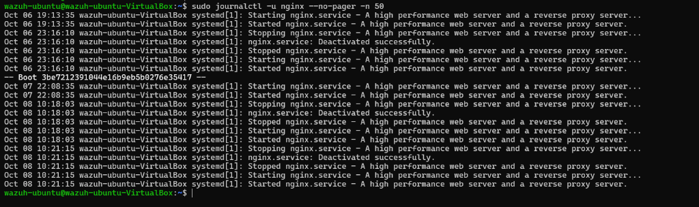

### 4. System Resource Capacity Monitoring
Monitored critical system resources to detect potential capacity bottlenecks.
* Assessed CPU load averages, memory allocation, and disk usage across the /var partition.

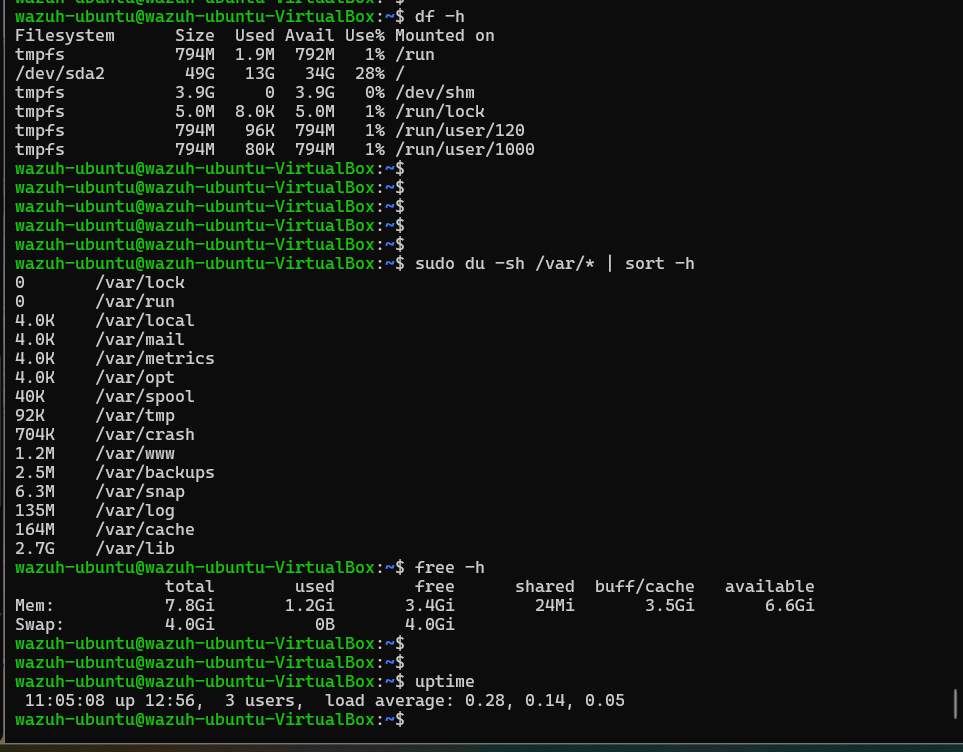

### 5. Deployment Verification
Conducted file system analysis to verify the integrity of the live application.
* Utilized text processing tools to search the source code and confirm the exact deployment version is active.

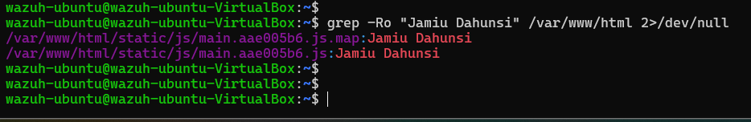

## Incident Response Simulations

### Incident 1: Configuration Syntax Failure
* Simulation: Introduced a critical syntax error into the Nginx configuration file.
* Recovery: Corrected the syntax, validated the configuration, and successfully reloaded the service.

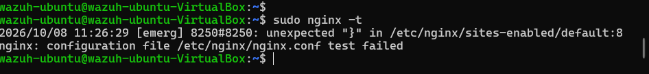
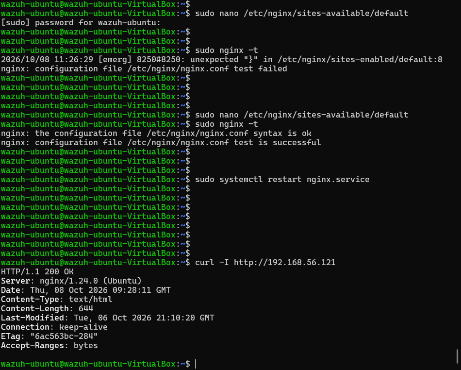

### Incident 2: Web Root Content Deletion
* Simulation: The primary web root directory was unexpectedly emptied, resulting in 500 Internal Server Error responses.
* Recovery: Restored the web root from a secure backup and verified the return of 200 OK HTTP responses.

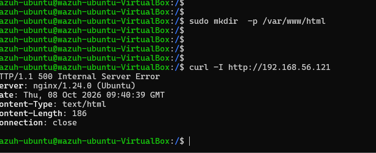
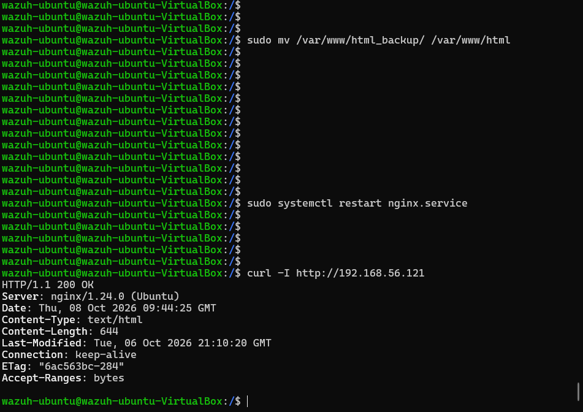

## Security and Reliability Standards
* Authentication: Enforced SSH key-based authentication over password sharing to prevent brute force attacks.
* Attack Surface Reduction: Restricted open ports exclusively to essential services (HTTP and SSH).
* Automation: Ensured critical services are enabled on boot to minimize downtime during unexpected server outages.
